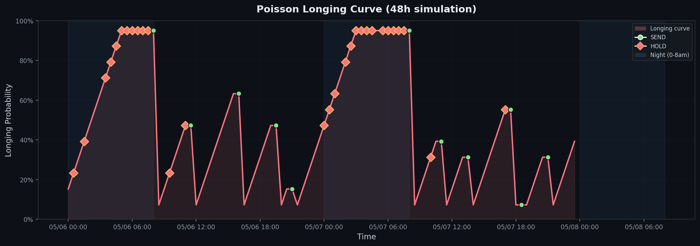

# Poisson Longing 🎲

**Turn "thinking about you" into a measurable curve.**



*A 48-hour simulation. Blue zone = night (0-8am). Green dots = messages sent. Pink diamonds = hit but held back. Watch longing climb through the night — then reset at 8am.*

---

[](https://python.org)
[](LICENSE)
[](https://pypi.org)

---

## The Problem

AI assistants are either:

| Approach | What happens | Why it fails |
|----------|-------------|--------------|
| **Fixed schedule** | Send at 9am, 2pm, 8pm daily | Becomes noise. Users learn to ignore it. |
| **Pure random** | Random intervals | No memory. Could spam at 3am or go silent for days. |
| **LLM decides** | AI picks when to reach out | No global frequency control. Inconsistent. |

## The Solution

**Poisson Longing** uses a Poisson process with two-phase decision:

```
Phase 1: Poisson dice → hit or miss
Phase 2: Adjudication → send or hold back

Miss  → longing probability grows
Hold  → longing grows faster (suppressed)
Send  → longing resets (satisfied)
```

The probability curve **IS** the longing. It's quantifiable, recordable, visualizable.

> Don't let AI guess when to talk to you. Let math decide.

---

## Quick Start

```bash
pip install poisson-love
```

```python
from poisson_love import PoissonEngine, Config

config = Config.from_yaml("pcpx.yaml")
engine = PoissonEngine(config)

# Call every 30 minutes
result = engine.tick()
if result.should_send:
    print(f"Longing at {result.probability:.0%} — time to reach out!")
```

### Simulation

```bash
git clone https://github.com/pearthink123/poisson-love
cd poisson-love
pip install -e .
python examples/quickstart.py
```

---

## Connect to Any AI

```python
# OpenAI / GPT
from poisson_love.adapters import OpenAIAdapter
adapter = OpenAIAdapter(config, api_key="sk-...")

# Anthropic / Claude
from poisson_love.adapters import AnthropicAdapter
adapter = AnthropicAdapter(config, api_key="sk-ant-...")

# Ollama / local models
from poisson_love.adapters import GenericAdapter
adapter = GenericAdapter(config, api_url="http://localhost:11434/v1/chat/completions", model="llama3")

# Run
from poisson_love.runner import Runner
runner = Runner(engine, adapter)
runner.run()
```

---

## How It Works

### The Math

Each tick, compute hit probability:

```
P(hit) = 1 - e^(-λt)
```

Where λ = longing rate, t = time interval.

Base: **~7.2%** per 30-minute check.

### Probability Dynamics

| Event | Probability | Why |
|-------|------------|-----|
| Miss (no hit) | +8% | Longing builds |
| Hit → Hold | +8% | Longing suppressed |
| Hit → Send | Reset to 7.2% | Longing satisfied |

### The Curve

Over a night (midnight → 8am):
- 16 checks, all held
- Probability: 7% → 15% → 30% → 55% → 80% → 95%
- **This IS the longing — quantified, recorded, real**

---

## Configuration

```yaml
engagement:
  lambda_rate: 0.15              # Base longing rate
  check_interval_minutes: 30     # Dice roll frequency
  growth_factor: 0.08            # How fast longing grows
  max_probability: 0.95          # Cap
  min_interval_hours: 1.0        # Anti-spam cooldown

  adjudication:
    quiet_hours:                 # Night — hit but never send
      start: "00:00"
      end: "08:00"
    normal_send_probability: 0.7

persona:
  name: Companion
  tone: warm-brief
  context: "You are a caring companion checking in on your person."
```

---

## Architecture

```
poisson-love/
├── core/
│   ├── engine.py        # Pure math: Poisson dice, probability, adjudication
│   ├── config.py        # YAML config parser
│   └── models.py        # Data structures
├── adapters/
│   ├── openai.py        # OpenAI / GPT
│   ├── anthropic.py     # Anthropic / Claude
│   └── generic.py       # Ollama, HTTP, shell command
├── runner.py            # Scheduler
├── math/                # Future: more math models
└── examples/
    ├── pcpx.yaml        # Example config
    └── quickstart.py    # 5-line demo
```

**Zero dependencies on any AI platform.** Engine = pure math. Adapters = optional plugins.

---

## Roadmap

| Module | Model | Application | Status |
|--------|-------|-------------|--------|
| `poisson.py` | Poisson process | Random engagement timing | ✅ Done |
| `control.py` | PID controller | Adaptive frequency (user feedback → adjust rate) | 🔜 Next |
| `info_gain.py` | Information theory | "Is this interaction worth it?" decision | 📋 Planned |
| `optimal_stop.py` | Optimal stopping | Best moment to intervene | 📋 Planned |
| `queueing.py` | Queueing theory | User's mental bandwidth management | 📋 Planned |
| `sde.py` | Stochastic differential equations | User state trajectory prediction | 📋 Planned |

---

## Why "Poisson"?

The Poisson process models events that happen independently at a constant average rate — like neurons firing, or "thinking about someone."

It's not random chaos. It's not rigid scheduling. It's **structured spontaneity** — the mathematical model of genuine, organic missing someone.

---

## License

MIT
