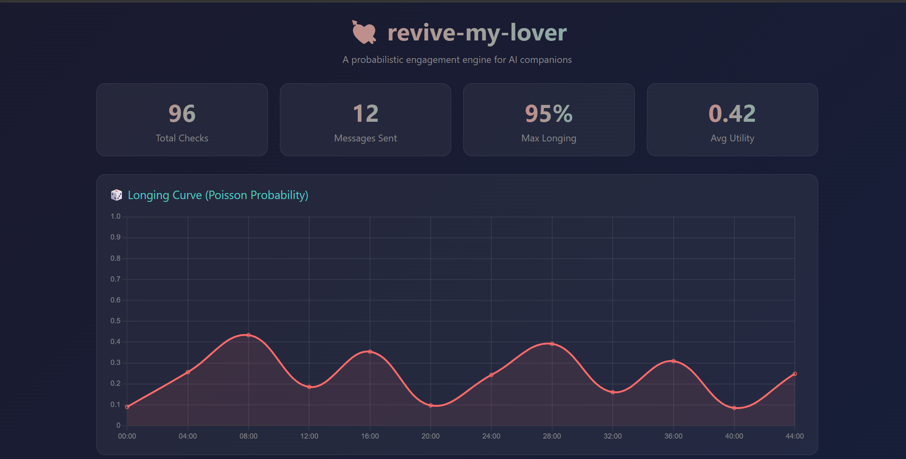
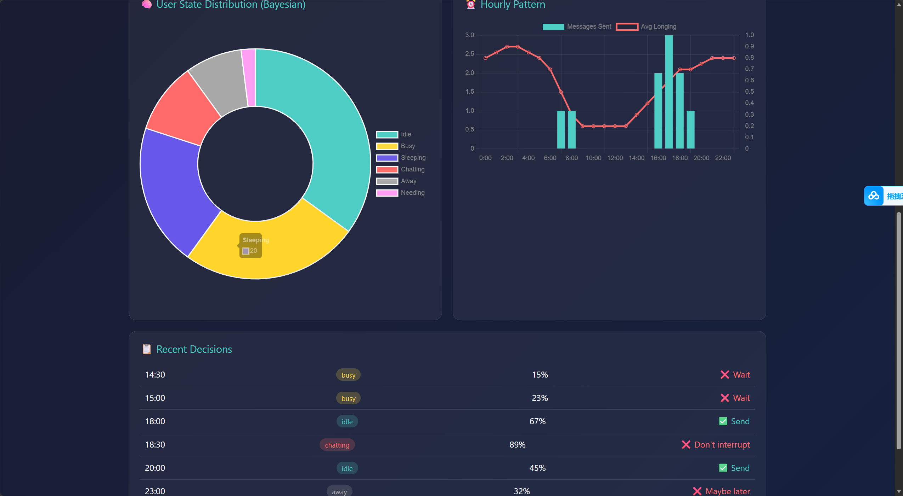

# revive-companion 💘

**A probabilistic engagement engine for AI companions.**

*Not "engaged → send more". Instead: "infer what the user is doing → decide if you should."*

---

[](https://python.org)
[](LICENSE)
[](https://github.com/pearthink123/revive-companion/actions/workflows/ci.yml)
[](https://pypi.org/project/revive-companion/)
[]()

English | [中文](README_zh.md)

---

## The Problem

AI companions are either **rigid** (fixed schedules) or **random** (no memory). Neither feels human.

## The Solution

A probabilistic engine that decides **when** and **whether** to reach out:

| Stage | Module | Question | Answer |
|-------|--------|----------|--------|
| 🎲 **Timing** | Poisson process | When to consider? | Randomized like real "thinking of you" |
| 📊 **Value** | Information theory | Is this worth it? | Skip if you already know user's state |
| 🧠 **State** | Bayesian inference | What's user doing? | Infer hidden state → decide accordingly |

---

> 🧠💫 **Want more?** Let your AI companion truly *remember*, *evolve relationships*, and have *emotional states*.
>
> **→ [affective-longing](https://github.com/pearthink123/affective-longing)** — Memory triggers + Relationship state machine + AI self-emotion (VAD model)
>
> ```bash
> pip install affective-longing[memory]
> ```

---

## Quick Start

```bash
pip install revive-companion
```

```python
from revive_my_lover import PoissonLove

love = PoissonLove()

result = love.tick()
if result.should_send:
    send_message(result.prompt)
    love.record_send()

# After user responds
love.record_reply(reply_speed=0.8, reply_length=0.6)
```

---

## How It Decides

The engine infers the user's **hidden state** from observations:

| Inferred State | Utility | Decision |
|---------------|---------|----------|
| 🗣️ **Chatting** | 0.2 | ❌ Don't interrupt |
| 💻 **Idle online** | 0.7 | ✅ Good time to reach out |
| 💼 **Busy** | 0.1 | ❌ Don't bother |
| 😴 **Sleeping** | 0.0 | ❌ Never send |
| 🚶 **Away** | 0.3 | ⏳ Maybe later |
| 🆘 **Needing** | 0.9 | ✅ Check in! |

No more "engaged → send more". Now it's: "user is probably busy → don't bother" or "user might need care → reach out".

---

## Use Any AI Backend

```python
# OpenAI / GPT
from revive_my_lover.adapters import OpenAIAdapter
adapter = OpenAIAdapter(config, api_key="sk-...")

# Anthropic / Claude
from revive_my_lover.adapters import AnthropicAdapter
adapter = AnthropicAdapter(config, api_key="sk-ant-...")

# Ollama / local models
from revive_my_lover.adapters import GenericAdapter
adapter = GenericAdapter(config, api_url="http://localhost:11434/v1/chat/completions")

# Run
from revive_my_lover.runner import Runner
runner = Runner(engine, adapter)
runner.run()
```

---

## Architecture

```
revive-companion/
├── love.py              # Unified API (start here)
├── core/
│   ├── engine.py        # Poisson dice + probability dynamics
│   ├── config.py        # YAML config
│   └── models.py        # Data structures
├── bayesian/
│   ├── core.py          # State estimation + send utility
│   └── learner.py       # Online learning from observations
├── info_gain/
│   ├── core.py          # Entropy × resolution potential
│   └── sources.py       # Silence, novelty, conversation state
├── control/
│   ├── pid.py           # PID controller (standalone use)
│   └── signal.py        # Pluggable signal framework
└── adapters/
    ├── openai.py        # OpenAI / GPT
    ├── anthropic.py     # Anthropic / Claude
    └── generic.py       # Ollama, HTTP, shell command
```

---

## How It Works

### The Math

Each tick, the engine computes hit probability:

```
P(hit) = 1 - e^(-λt)
```

Where λ = longing rate, t = time interval. Base: ~7.2% per 30-minute check.

### Probability Dynamics

| Event | Probability | Why |
|-------|------------|-----|
| Miss (no hit) | +8% | Longing builds |
| Hit → Hold | +8% | Longing suppressed |
| Hit → Send | Reset to 7.2% | Longing satisfied |

### The Curve

Over a night (midnight → 8am):
- 16 checks, all held
- Probability: 7% → 15% → 30% → 55% → 80% → 95%
- **This IS the longing — quantified, recorded, real**

---

## Configuration

```yaml
engagement:
  lambda_rate: 0.15              # Base longing rate
  check_interval_minutes: 30     # Dice roll frequency
  growth_factor: 0.08            # How fast longing grows
  max_probability: 0.95          # Cap
  min_interval_hours: 1.0        # Anti-spam cooldown

  adjudication:
    quiet_hours:
      start: "00:00"
      end: "08:00"
    normal_send_probability: 0.7

persona:
  name: Companion
  tone: warm-brief
  context: "You are a caring companion checking in on your person."
```

---

## Dashboard

Visualize the AI engagement decision process: longing curves, state distributions, and send history.

```bash
# Install dashboard dependencies
pip install -e ".[dashboard]"

# Run dashboard
streamlit run dashboard.py
```





Features:
- 🎲 **Longing Curve** — Poisson probability over time
- 🧠 **State Distribution** — Bayesian-inferred user state
- ⏰ **Hourly Pattern** — When messages are most likely sent
- 📋 **Decision Log** — Detailed record of each decision

---

## Demos

```bash
git clone https://github.com/pearthink123/revive-companion
cd revive-companion
pip install -e .

PYTHONPATH=src python examples/quickstart.py              # Basic simulation
PYTHONPATH=src python examples/bayesian_demo.py           # State inference
PYTHONPATH=src python examples/bayesian_learning_demo.py  # Online learning
PYTHONPATH=src python examples/info_gain_demo.py          # Information gain
PYTHONPATH=src python examples/integration_example.py     # Smart notifier
```

## Integration

### Simple Integration (Any Bot)

```python
from revive_my_lover import PoissonLove

love = PoissonLove()

# Check periodically
result = love.tick()
if result.should_send:
    send_message("Thinking of you~")
    love.record_send()

# When user replies
love.record_reply(reply_speed=0.8, reply_length=0.6)
```

### Telegram Bot

```bash
# Install dependency
pip install python-telegram-bot

# Run
python examples/telegram_bot.py --token YOUR_TOKEN --chat-id YOUR_CHAT_ID
```

### Discord / Slack / WeChat

Same pattern, just swap the send function:

```python
# Discord
await channel.send(message)

# Slack
slack_client.chat_postMessage(channel=channel_id, text=message)

# WeChat (itchat)
itchat.send(message, toUserName=friend_name)
```

---

## Testing

```bash
# Install test dependencies
pip install -e ".[test]"

# Run all tests
pytest tests/ -v
```

124 tests covering:
- 🎲 Poisson engine (determinism, growth, timing)
- 🧠 Bayesian inference (state estimation, likelihood, learning)
- 📊 Information gain (decay, thresholds)
- 💘 Unified API (full pipeline)

---

## Consent & Safety

This library is designed for **respectful AI engagement**. Please use it responsibly:

### Built-in Protections
- **Quiet hours**: No messages during configured sleep periods
- **Minimum interval**: Anti-spam cooldown between messages
- **State inference**: Won't bother users who are busy or sleeping
- **Utility threshold**: Conservative default (0.5) — only sends when appropriate

### Best Practices
- ✅ **Opt-in**: Users should explicitly enable proactive messaging
- ✅ **Easy disable**: Users must be able to turn it off at any time
- ✅ **Transparency**: Users should know the AI can initiate contact
- ✅ **No emotional manipulation**: Don't use this to create dependency
- ❌ **No unsolicited contact**: Don't message users who didn't opt in
- ❌ **No persistence**: Respect when users want to be left alone

### Default Behavior
- Messages are **never** sent during quiet hours (default: 00:00-08:00)
- At least **1 hour** between messages (configurable)
- High engagement **does not** mean more messages (unlike simple linear models)
- The engine **infers state** before deciding, not just response speed

---

## Why "Poisson"?

The Poisson process models events that happen independently at a constant average rate — like neurons firing, or "thinking about someone."

It's not random chaos. It's not rigid scheduling. It's **structured spontaneity** — the mathematical model of genuine, organic missing someone.

---

## What's Next

This is the **stable base** — focused on smart timing, not deep emotion.

For memory-triggered longing, relationship state machines, and AI self-emotion modeling, see:

**→ [affective-longing](https://github.com/pearthink123/affective-longing)** — Emotional extension with 3 layers (Memory + Relationship + Emotion)

---

## License

MIT
